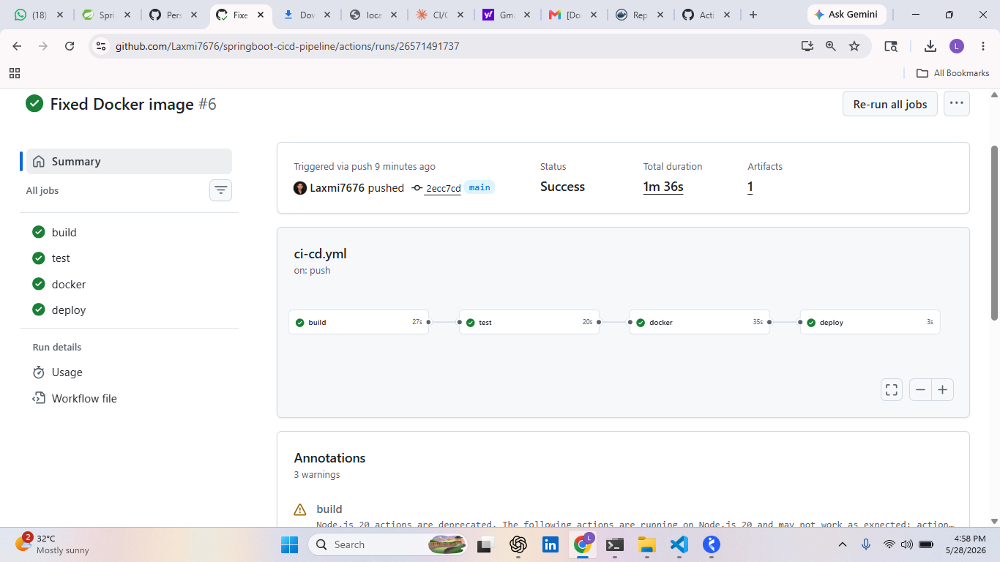
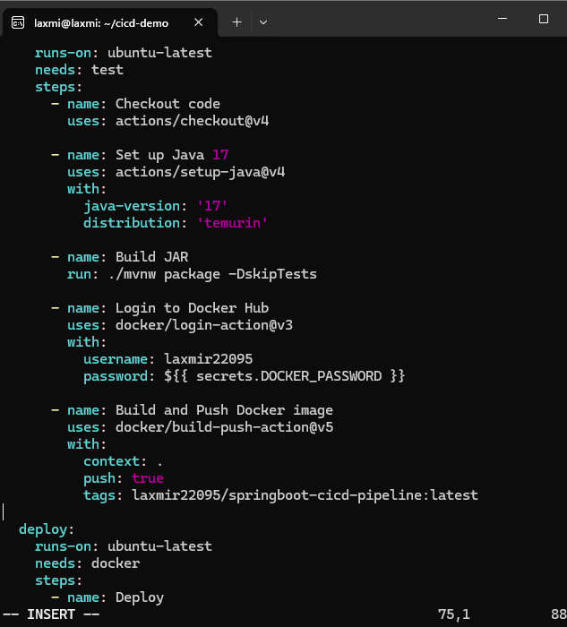
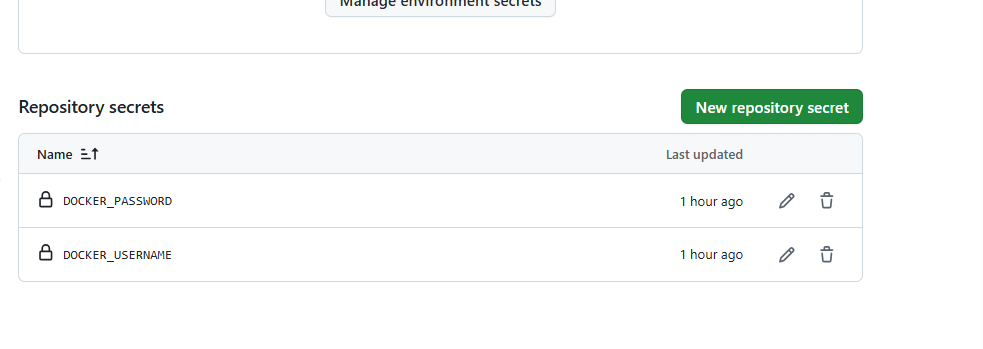
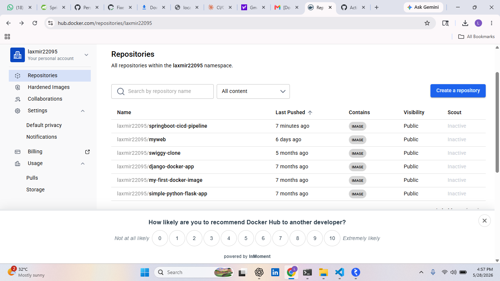

# Spring Boot CI/CD Pipeline

A production-grade Spring Boot REST API with a fully automated CI/CD pipeline using GitHub Actions and Docker.

## Tech Stack
- Java 17
- Spring Boot 3.5.14
- Maven
- Docker
- GitHub Actions

## API Endpoints
| Endpoint | Method | Response |
|---|---|---|
| `/hello` | GET | Hello from CI/CD Pipeline! |
| `/status` | GET | App is running successfully! |
| `/actuator/health` | GET | {"status":"UP"} |

## CI/CD Pipeline
The pipeline has 4 stages that run automatically on every push to main:
push code
↓
build  → compiles code, packages JAR
↓
test   → runs unit tests
↓
docker → builds image, pushes to Docker Hub
↓
deploy → app is live

## Run Locally
```bash
# Clone the repo
git clone https://github.com/Laxmi7676/springboot-cicd-pipeline.git
cd springboot-cicd-pipeline

# Run the app
./mvnw spring-boot:run

# Run tests
./mvnw test
```

## Run with Docker
```bash
docker pull laxmir22095/springboot-cicd-pipeline:latest
docker run -p 8080:8080 laxmir22095/springboot-cicd-pipeline:latest
```

## Docker Hub
Image available at: https://hub.docker.com/r/laxmir22095/springboot-cicd-pipeline

## Pipeline Success


## Pipeline YAML Config


## GitHub Secrets Configuration


## Docker Hub Image

